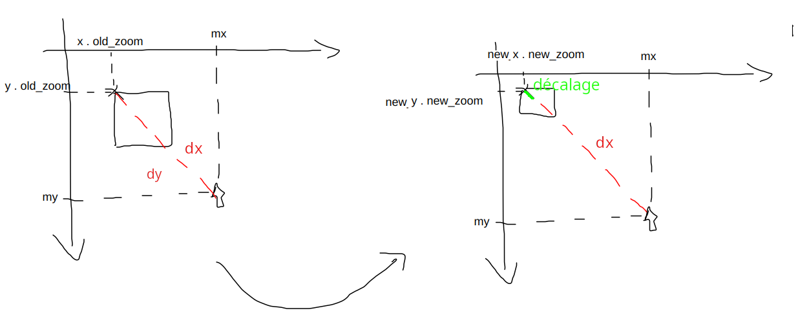

## Position du problème :

Calculer les coordonnées des points de l’image (carré sur le schéma) dans un nouveau repère avec un `new_zoom` depuis un repère avec un `old_zoom`

Quand on passe du repère `old_zoom` -> `new_zoom` il faut que :

* la position (à l’écran) de la souris soit invariante (« origine » du zoom)
* la distance entre les points de l’image (x, y) et la position de la souris soit proportionnelle au zoom

**Attention** : bien faire la distinction : `mx` et `my` sont les positions de la souris *à l’écran*, alors que `x` et `y` sont les coordonnées des points de l’image dans le repère de l’image (c’est là qu’est le piège où je me suis fait avoir)

## Une histoire de repères

Mon intuition c’est que la fonction `love.graphics.scale()` est juste une homothétie (multiplication par une matrice (2×2) : 
$$
\begin{bmatrix}Sx & 0\\0 & Sy\end{bmatrix}
$$


Elle « dilate » le repère selon des facteurs $Sx$ et $Sy$ (suivant les axes respectifs $x$ et $y$), et est centrée sur l’origine : si le repère est centré sur la figure cette figure grossirait/diminurait sans bouger, par contre si elle est pas centrée de fait le « zoom » provoque une translation de la figure également.

Techniquement, pour faire ce que tu veux faire, il faudrait translater l’origine du repère sur la position de la souris, faire le zoom, et ensuite faire la translation inverse en replaçant l’origine sur sa « nouvelle » position dans l’espace zoomé (comme je t’ai dit ce serait super facile à faire si tu implémentais toi-même le zoom). 

Voyons comment faire avec les moyens que nous donne Löve2D en utilisant `love.graphics.scale()`.

Soit $(x, y)$ un point de l’image (on va juste raisonner avec $x$, ce sera la même chose pour les $y$). 

### Coordonnées dans un repère zoomé (à l’écran)

Pour calculer la position de ce point de l’image à l’écran selon un zoom donné, on a : $x_{écran} = x · zoom$  (même si tu ne joue pas avec ta molette on est forcément dans un état « zoomé », la position neutre de départ pouvant être par exemple $zoom = 1$).

Nous savons que nous allons faire « bouger » le repère, donc il vaut mieux expliciter la position de l’origine. En réalité :
$$
\tag{A}
x_{écran} = (x +x_{origine}) · zoom
$$
avec de base $x_{origine} = 0$, on retombe sur la première formule.

### Coordonnées de la souris

`love.mouse.getPosition()` nous donne la position `mx` de la souris à l’écran (donc dans l’espace déjà zoomé). Il faut donc calculer sa position dans le repère de l’image (comme si on n’avait pas zoomé). on peut le faire en appliquant la formule ci-dessus dans le cas de la souris :
$$
mx = (x_{souris}  + x_{origine}) . zoom
$$
$ x_{souris}$ étant le point correspondant à la position de la souris dans le repère de l’image à afficher. De là on calcule facilement :
$$
x_{souris} = \frac{mx}{zoom} - x_{origine}
$$


Si on positionne l’origine sur un point x de l’image, on  a :
$$
\tag{B}
x_{souris} = \frac{mx}{zoom} - x
$$


Plus précisément, si, comme sur le schéma ci-dessus $x$ est un point référence de l’image, et que la souris est à une position décalée de ce point (x + dx) la formule est :
$$
x_{souris} = (x + dx) · zoom \\
x_{souris} = x · zoom + dx · zoom \\
\text{d’où on peut tirer :} \\
dx = \frac{x_{souris}}{zoom} - x \\
\text{Nous allons calculer la position après un nouveau zoom, pour distinguer appelons cette position de départ :} \\
\tag{C}
dx = \frac{x_{souris}}{old\_zoom} - x
$$
 Écrivons la situation après avoir fait un `new_zoom`. On veut aussi que `mx` soit invariant dans le nouveau zoom !  `mx` n’a pas changé, mais on peut regarder à quoi correspond sa position dans l’image nouvellement zoomée.  On veut aussi conserver `dx` (il ne change que proportionnelement, d’un facteur `new_zoom`), mais trouver la nouvelle position $x_{new}$ du point $x$ du repère `old_zoom` car ce point se sera translaté pendant le zoom (en gros tout le reste est constant).

Dans ce repère `new_zoom` on peut aussi exprimer la position `mx` de la souris :
$$
mx = (x_{nouveau} + dx) · new\_zoom \\
mx = x_{nouveau} · new\_zoom + dx . new\_zoom \\
\text{on peut remplacer }dx\text{ – qui n’a pas changé – par la formule (C) vu ci-dessus :} \\
mx = x_{nouveau} · new\_zoom + \frac{x_{souris}}{old\_zoom} - x . new\_zoom \\
\text{et à partir de là on peut exprimer }x_{nouveau} : \\
x_{nouveau} = \frac{mx}{new\_zoom} - (\frac{mx}{ancien\_zoom} - x)
$$


On peut donc créer une fontion de zoom qui modifie les coordonnées x et y d’une image :

```lua
function love.wheelmoved(x, y)
    -- Sauvegarder l'ancien zoom
    local ancienZoom = zoom
    
    -- Modifier le zoom
    if y > 0 then
        zoom = zoom + zoomSpeed
    elseif y < 0 then
        zoom = math.max(0.1, zoom - zoomSpeed)
    end
    
    -- Récupérer la position de la souris (espace écran)
    local mx, my = love.mouse.getPosition()
    
    -- Le point qu'on veut garder fixe :
    -- Position écran avant : imgX * ancienZoom
    -- Position écran après : imgX_new * zoom
    -- On veut que la distance souris-image reste proportionnelle
    
    imgX = mx / zoom - (mx / ancienZoom - imgX)
    imgY = my / zoom - (my / ancienZoom - imgY)
end
```


